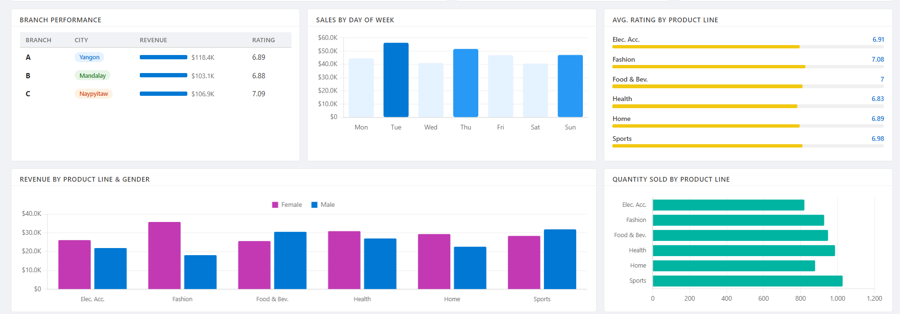
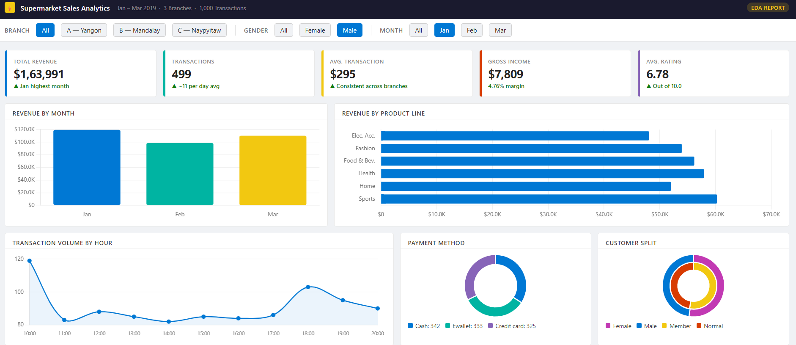

#  Supermarket Sales — Exploratory Data Analysis (EDA)


A comprehensive Exploratory Data Analysis (EDA) project on a supermarket sales dataset, uncovering patterns in customer behaviour, product performance, branch revenue, and purchasing trends using Python.

---

##  Dashboard Preview




---

##  Table of Contents

- [Overview](#-overview)
- [Dataset Description](#-dataset-description)
- [Project Structure](#-project-structure)
- [Key Analyses Performed](#-key-analyses-performed)
- [Technologies Used](#-technologies-used)
- [Getting Started](#-getting-started)
- [Key Insights](#-key-insights)
- [Contributing](#-contributing)

---

##  Overview

This project performs a thorough EDA on historical sales data from a supermarket chain operating across multiple branches and cities. The goal is to extract meaningful business insights that can inform decisions around inventory management, marketing strategy, customer segmentation, and revenue optimisation.

The analysis covers:
- Sales trends over time (daily, monthly)
- Branch and city-level performance comparison
- Customer demographics and purchasing behaviour
- Product line profitability and customer ratings
- Payment method preferences

---

##  Dataset Description

**File:** `supermarket_sales.csv`  
**Source:** [Kaggle – Supermarket Sales Dataset](https://www.kaggle.com/datasets/aungpyaeap/supermarket-sales)  
**Records:** 1,000 transactions  
**Period:** January 2019 – March 2019

| Column | Description |
|---|---|
| `Invoice ID` | Unique transaction identifier |
| `Branch` | Store branch (A, B, or C) |
| `City` | City where the branch is located |
| `Customer type` | Member or Normal customer |
| `Gender` | Customer gender |
| `Product line` | Category of product purchased |
| `Unit price` | Price per unit (USD) |
| `Quantity` | Number of units purchased |
| `Tax 5%` | 5% tax on the purchase |
| `Total` | Total transaction amount including tax |
| `Date` | Transaction date |
| `Time` | Transaction time |
| `Payment` | Payment method (Cash, Credit card, E-wallet) |
| `COGS` | Cost of goods sold |
| `Gross margin percentage` | Gross margin as a percentage |
| `Gross income` | Gross income from the transaction |
| `Rating` | Customer satisfaction rating (1–10) |

---

##  Project Structure

```
Exploratory_Data_Analysis-EDA-Supermarket_Sales/
│
├── 01_EDA_Supermarket_file.ipynb   # Main analysis notebook
├── supermarket_sales.csv           # Raw dataset
└── README.md                       # Project documentation
```

---

##  Key Analyses Performed

### 1. Data Overview & Cleaning
- Shape, data types, and missing value checks
- Parsing `Date` and `Time` columns into proper datetime formats
- Descriptive statistics for numerical and categorical features

### 2. Univariate Analysis
- Distribution of sales totals, unit prices, quantities, and ratings
- Frequency distributions for branches, product lines, payment methods, and gender

### 3. Bivariate & Multivariate Analysis
- Revenue breakdown by branch, city, and product line
- Customer type vs. purchasing behaviour
- Gender vs. product line preferences
- Payment method usage by branch

### 4. Time-Series Analysis
- Sales trends across months and days
- Peak transaction hours throughout the day

### 5. Correlation Analysis
- Heatmap of numerical feature correlations
- Relationship between quantity, unit price, and gross income

### 6. Customer Satisfaction
- Rating distribution by product line and branch
- Average rating by customer type and gender

---

##  Technologies Used

| Tool | Purpose |
|---|---|
| **Python 3.8+** | Core programming language |
| **Pandas** | Data loading, cleaning, and manipulation |
| **NumPy** | Numerical computations |
| **Matplotlib** | Base visualisation library |
| **Seaborn** | Statistical data visualisation |
| **Jupyter Notebook** | Interactive analysis environment |

---


##  Key Insights

- **Branch C** generates the highest overall revenue, while **Branch A** records the highest customer satisfaction ratings on average.
- **Food and Beverages** and **Sports and Travel** are the top-performing product lines by gross income.
- **Female customers** tend to purchase from Fashion Accessories and Food & Beverages, while **male customers** favour Health & Beauty and Electronic Accessories.
- **E-wallet** is the most popular payment method, followed closely by Cash.
- Peak shopping hours occur around **1 PM** and **7 PM**, suggesting strong lunchtime and evening footfall.
- **Members** and **Normal** customers contribute nearly equal revenue, indicating a balanced customer base.
- Customer ratings are fairly uniformly distributed between 4 and 10, with an average of approximately **7.0**.

---


*If you find this project useful, consider giving it a on GitHub!*

